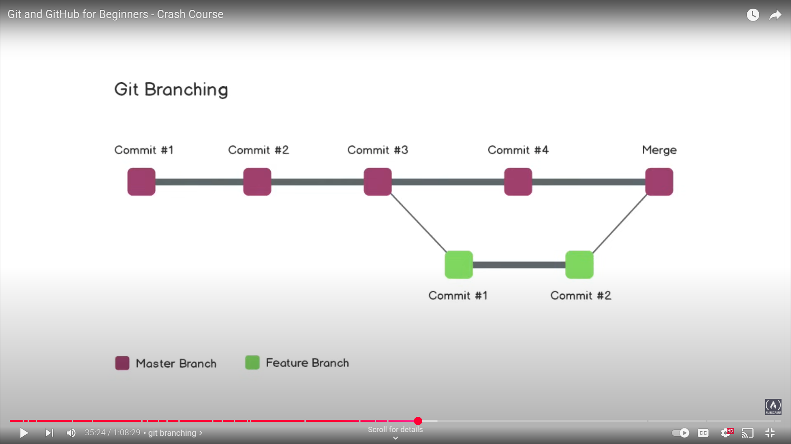

# Demo-Repository
## For Learning Git
### Reference
[Git Tutorial Video](https://www.youtube.com/watch?v=RGOj5yH7evk)

# Git and GitHub Overview

## Git
Git is a version control system (VCS) that helps developers track changes in their code, collaborate with others, and manage different versions of a project efficiently.

- **Type**: Distributed Version Control System (DVCS)
- **Usage**: Tracks changes in files, allows branching and merging, enables collaboration
- **Installation**: Needs to be installed on your local machine

### Common Commands
- `git init` → Initialize a repository
- `git add .` → Stage changes
- `git commit -m "Message"` → Commit changes
- `git push` → Push changes to a remote repository

---

## GitHub
GitHub is a cloud-based platform that provides remote hosting for Git repositories. It allows teams to collaborate, review code, and manage projects online.

- **Type**: Web-based Git repository hosting service
- **Usage**: Stores Git repositories online, provides collaboration tools like pull requests, issues, and actions
- **URL**: [https://github.com](https://github.com)

### Key Features
- Public & Private Repositories
- Pull Requests & Code Reviews
- Issues & Project Management
- GitHub Actions (CI/CD)

---

## Git Commands

```bash
# Initialize a new Git repository
git init

# Check the status of the repository
git status

# Add all changes to the staging area
git add .

# Commit changes with a message
git commit -m "Your commit message"

# Push changes to the remote repository
git push

# Push changes to the master branch of the remote repository
git push origin master

# Set up an empty repository and connect it as remote
git init
# Copy the HTTP link of the empty repository
git remote add origin <repository-link>


```
# This is new feature 
### Git Branching

Branching in Git allows you to work on different features or fixes independently without affecting the main codebase. It is a powerful feature for managing parallel development.

#### Example Workflow

```bash
# List all branches
git branch

# Create and switch to a new branch named 'feature1'
git checkout -b feature1
Switched to a new branch 'feature1'

# Verify the current branch
git branch
* feature1
    main
```
### Git Log

The `git log` command is used to view the commit history of a repository. It shows details like commit hash, author, date, and commit message.

#### Example Usage

```bash
# View the commit history
git log

# View a simplified commit history
git log --oneline
```

---

### Git Checkout

The `git checkout` command is used to switch between branches or restore files in your working directory.

#### Example Usage

```bash
# Switch to an existing branch
git checkout <branch-name>

# Restore a specific file to its last committed state
git checkout -- <file-name>
```

#### Visual Representation


This example demonstrates how to create a new branch, switch to it, and verify the active branch.

