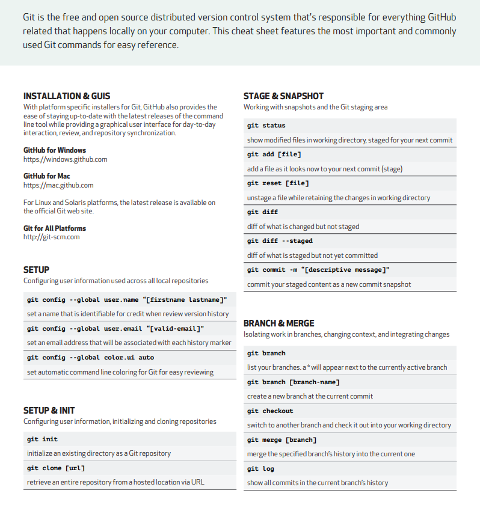

# Demo-Repository
## For Learning Git
### Reference
[Git Tutorial Video](https://www.youtube.com/watch?v=RGOj5yH7evk)

# Git and GitHub Overview

## Git
Git is a version control system (VCS) that helps developers track changes in their code, collaborate with others, and manage different versions of a project efficiently.

- **Type**: Distributed Version Control System (DVCS)
- **Usage**: Tracks changes in files, allows branching and merging, enables collaboration
- **Installation**: Needs to be installed on your local machine
  
### Git Configuration

After installing Git, you can configure it with your user information and verify the installation.

#### Check Git Version

```bash
# Check the installed Git version
git --version
```

#### Set User Information

```bash
# Set your name
git config --global user.name "Your Name"

# Set your email
git config --global user.email "youremail@domain.com"
```

#### View Configuration

You can see all the configuration items that have been set by typing:

```bash
# List all Git configuration settings
git config --list
```

### Common Commands
- `git init` → Initialize a repository
- `git add .` → Stage changes
- `git commit -m "Message"` → Commit changes
- `git push` → Push changes to a remote repository

---

## GitHub
GitHub is a cloud-based platform that provides remote hosting for Git repositories. It allows teams to collaborate, review code, and manage projects online.

- **Type**: Web-based Git repository hosting service
- **Usage**: Stores Git repositories online, provides collaboration tools like pull requests, issues, and actions
- **URL**: [https://github.com](https://github.com)

### Key Features
- Public & Private Repositories
- Pull Requests & Code Reviews
- Issues & Project Management
- GitHub Actions (CI/CD)

---

## Git Commands

```bash
# Initialize a new Git repository
git init

# Check the status of the repository
git status

# Add all changes to the staging area
git add .

# Commit changes with a message
git commit -m "Your commit message"

# Push changes to the remote repository
git push

# Push changes to the master branch of the remote repository
git push origin master

# Set up an empty repository and connect it as remote
git init
# Copy the HTTP link of the empty repository
git remote add origin <repository-link>


```

# Feature 2 can be added here

# This is new feature adding branched
### Git Branching

Branching in Git allows you to work on different features or fixes independently without affecting the main codebase. It is a powerful feature for managing parallel development.


A branch in Git is a lightweight movable pointer to a commit. It allows you to work on different features or fixes independently without affecting the main codebase. The default branch in most repositories is called `main` or `master`.

### How to Change the Default Branch?

To change the default branch in a repository:

1. Go to your repository on GitHub.
2. Navigate to **Settings** > **Branches**.
3. Under the "Default branch" section, click **Change default branch**.
4. Select the branch you want to set as the default and click **Update**.

### How to Create a Branch and Checkout to a Different Branch?

To create a new branch and switch to it:

```bash
# Create a new branch named 'feature1'
git branch feature1

# Switch to the newly created branch
git checkout feature1
```

Alternatively, you can combine the two steps into one:

```bash
# Create and switch to a new branch named 'feature1'
git checkout -b feature1
```

To list all branches and verify the current branch:

```bash
# List all branches
git branch

# The current branch will be highlighted with an asterisk (*)
```

#### Example Workflow

```bash
# List all branches
git branch

# Create and switch to a new branch named 'feature1'
git checkout -b feature1
Switched to a new branch 'feature1'

# Verify the current branch
git branch
* feature1
    main
```
### Git Log

The `git log` command is used to view the commit history of a repository. It shows details like commit hash, author, date, and commit message.

#### Example Usage

```bash
# View the commit history
git log

# View a simplified commit history
git log --oneline
```

---

### Git Checkout

The `git checkout` command is used to switch between branches or restore files in your working directory.

#### Example Usage

```bash
# Switch to an existing branch
git checkout <branch-name>

# Restore a specific file to its last committed state
git checkout -- <file-name>
```


#### Visual Representation


This example demonstrates how to create a new branch, switch to it, and verify the active branch.


### Git Diff

The `git diff` command is used to view the differences between changes in your working directory, staging area, or between commits.

#### Example Usage

```bash
# Show changes in the working directory that are not staged
git diff

# Show changes between the staging area and the last commit
git diff --staged

# Show changes between two commits
git diff <commit1> <commit2>
```

---

### Git Push with Upstream

The `git push -u origin <branch-name>` command is used to push a branch to the remote repository and set it as the upstream branch for future pushes.

#### Example Usage

```bash
# Push the current branch to the remote repository and set upstream
git push -u origin <branch-name>
```

---

### Git Merge

The `git merge` command is used to combine changes from one branch into another. Typically, you merge a feature branch into the main branch after completing the feature.

#### Example Usage

```bash
# Merge the specified branch into the current branch
git merge <branch-name>
```

---

### Git Branch Deletion

The `git branch -d` command is used to delete a branch that has been fully merged. Use `git branch -D` to force delete a branch that hasn't been merged.

#### Example Usage

```bash
# Delete a branch that has been merged
git branch -d <branch-name>

# Force delete a branch that hasn't been merged
git branch -D <branch-name>
```
### Git Reset

The `git reset` command is used to undo changes by resetting the current branch to a specific state. It can modify the staging area and working directory depending on the options used.

#### Example Usage

```bash
# Reset the staging area to match the last commit
git reset

# Undo the last commit but keep the changes in the working directory
git reset HEAD~1

# Reset to a specific commit and keep changes in the working directory
git reset <commit-hash>

# Reset to a specific commit and discard all changes in the working directory
git reset --hard <commit-hash>
```

### Adding and Removing Remote Origin

#### Add a Remote Origin

To add a remote origin to your local repository, use the `git remote add` command:

```bash
# Add a remote origin with the specified repository URL
git remote add origin <repository-url>
```

#### Remove a Remote Origin

To remove an existing remote origin, use the `git remote remove` command:

```bash
# Remove the remote origin
git remote remove origin
```

```bash
# List all configured remotes
git remote -v
```
### Git Rebase

The `git rebase` command is used to integrate changes from one branch into another by moving or "rebasing" the commits of the current branch onto the tip of another branch. This creates a linear commit history, making it cleaner and easier to read.

#### Example Usage

```bash
# Rebase the current branch onto the specified branch
git rebase <branch-name>

# Rebase interactively to edit, reorder, or squash commits
git rebase -i <branch-name>
```


# Important cmnds




### Git Stash

The `git stash` command is used to temporarily save changes in your working directory and staging area without committing them. This is useful when you need to switch branches or work on something else without losing your current progress.

#### Common Commands

```bash
# Save modified and staged changes
git stash

# List stack-order of stashed file changes
git stash list

# Apply the changes from the top of the stash stack and remove it
git stash pop

# Discard the changes from the top of the stash stack
git stash drop
```

---

### Git Log and Diff

#### Compare Branches

```bash
# Show the commits on branchA that are not on branchB
git log branchB..branchA
```

#### Track File Changes Across Renames

```bash
# Show the commits that changed a file, even across renames
git log --follow [file]
```

#### Compare Differences Between Branches

```bash
# Show the diff of what is in branchA that is not in branchB
git diff branchB...branchA
```

---

### Git Show

The `git show` command is used to display information about any Git object in a human-readable format, such as commits, tags, or blobs.

#### Example Usage

```bash
# Show details of a specific commit or object
git show [SHA]
```